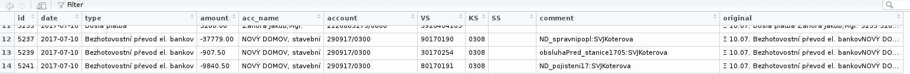

# CSOB_reader

*CSOB* (a bank in czech rep.) has strange monthly printouts (various formats but no CSV-like format). 


This small project read strange txt printout and put into proper tibble (table) wich is saved to disk in the end. 
The Output table can be further processed. *CSOB_reader* might come handy normal people (who wants to process/understand 
their financial input/outputs), or small non-profit institutions like committee of flat owners who do not want 
to spend money on pricey API for simple automatic account checking.

Run:
```
./csobReader.R -f printout.txt > CSOB1707.csv
```


An example of output' table:



Czech version:

*CSOB_reader* cte vypisy a formatuje je do tibble (tabulka) formatu, kt. je nasledne ulozen jako CSV soubor. Poslouzi 
beznym lidem, co chteji mit prehled o svych uctech, prip.  malym neziskovkam (jako Spolecenstvi vlastniku jednotek) pro
spravu jejich uctu (neni potreba mit CSOB API na zpracovavani dat)
